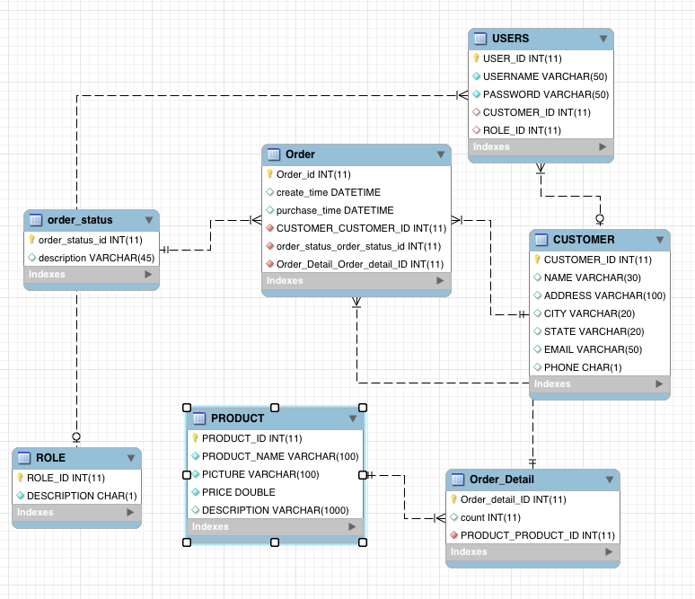

# README #

Shop Online

## Description

This project is a practice how to design a web application with Java.

### Instructor
	Reiner.Dojen
### Developers
  * [Paerhati.Remutula](mailto:parhat.remtulla@outlook.com)
  * [Dongao.Li](mailto:lidongao1993@126.com)
  * [Hang.Liu](mailto:aries.liu@foxmail.com)

## Project Details ##

### Keywords ###

* JSF
* JPQL
* EJB
* GlassFish
* MessageDriven
* OWAS TOP 10

### Features ###

* Customers
* Shopping cart
* Orders
* Login

#### Customers ####

* Browse items
* Search (ID, Name)
* Add/Remove items to shopping cart
* View/Search (ID, Name)/Edit their profile
* Check/Cancel Orders

#### Admin ####

* Add/Remove/Sort items

### Pages ###

* Login
* Main page
* Items pages(search/view)
* Item detail
* Shopping cart page
* Orders' list
* Order detail
* Profile list
* Profile detail

### Database ###

Diagram of Database 
